# spring-boot-forgot-password

### Image Screen shot

Sign Up Page

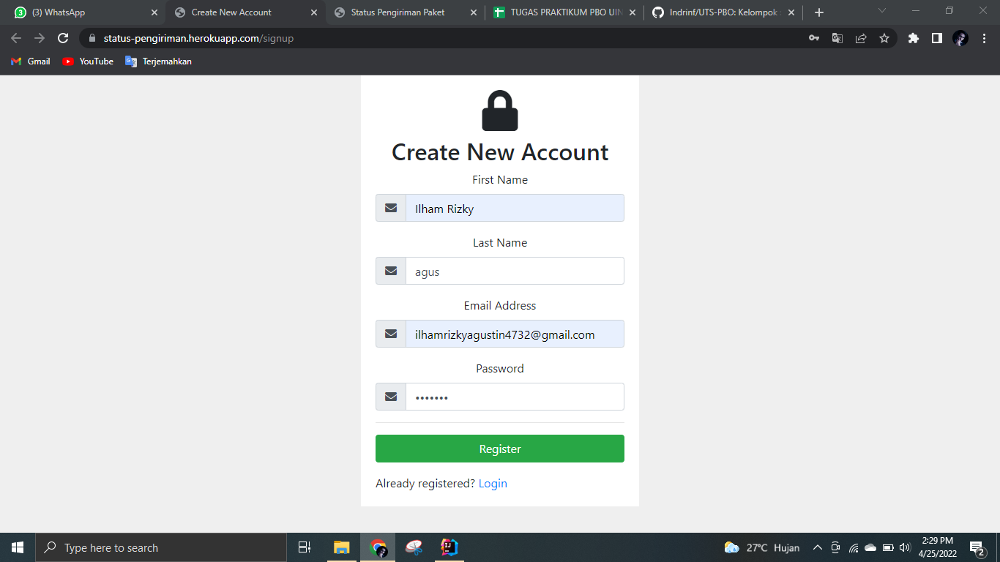

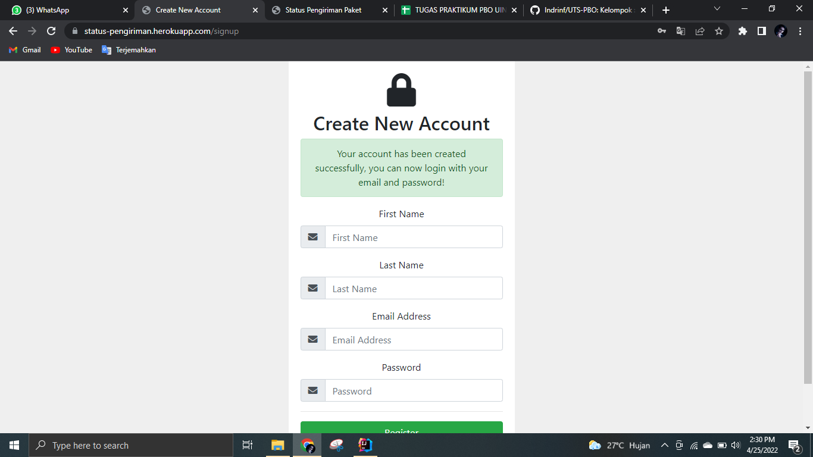

Sign In Page

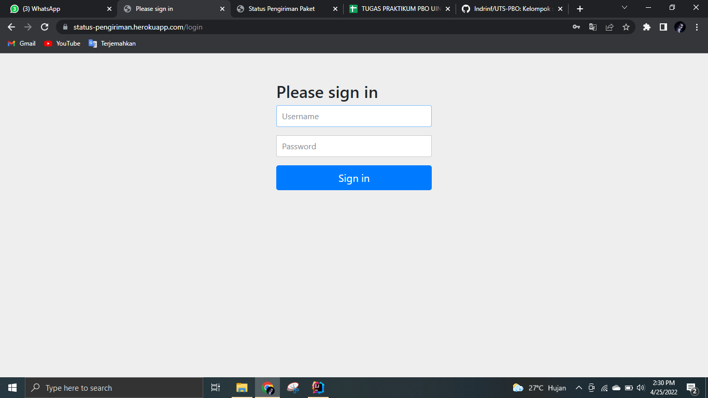

Main Page

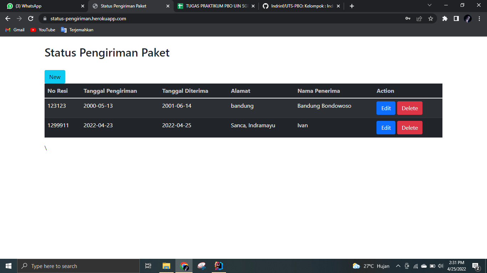

New Page

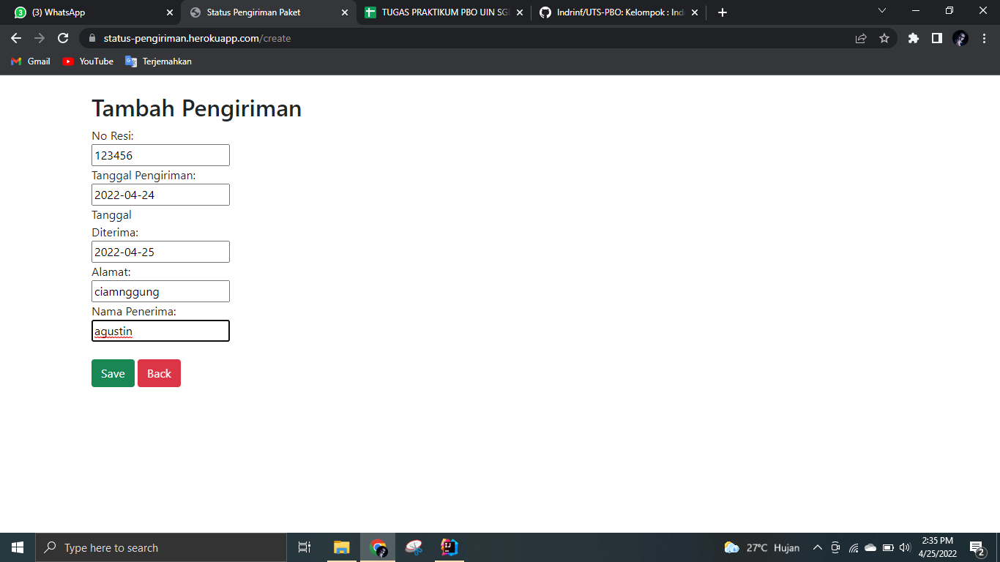

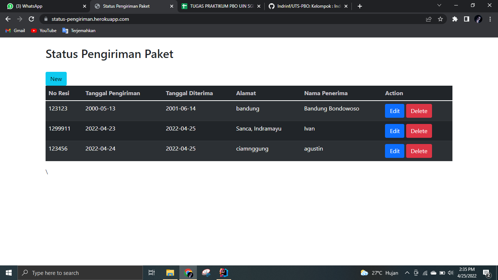

Edit Page

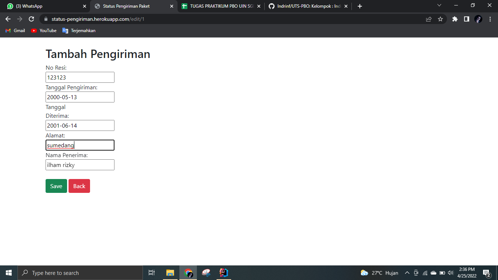

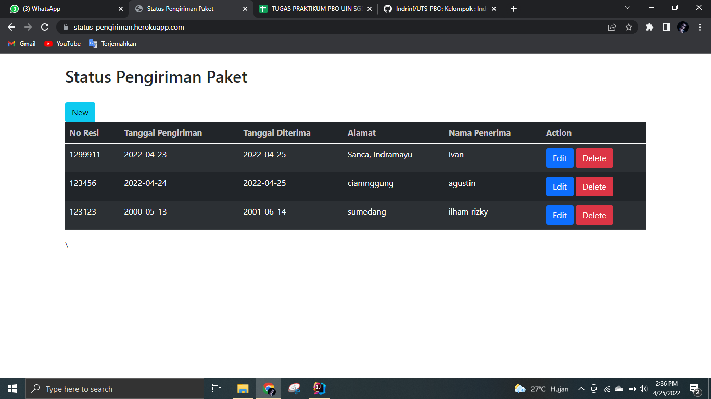

Delete Page

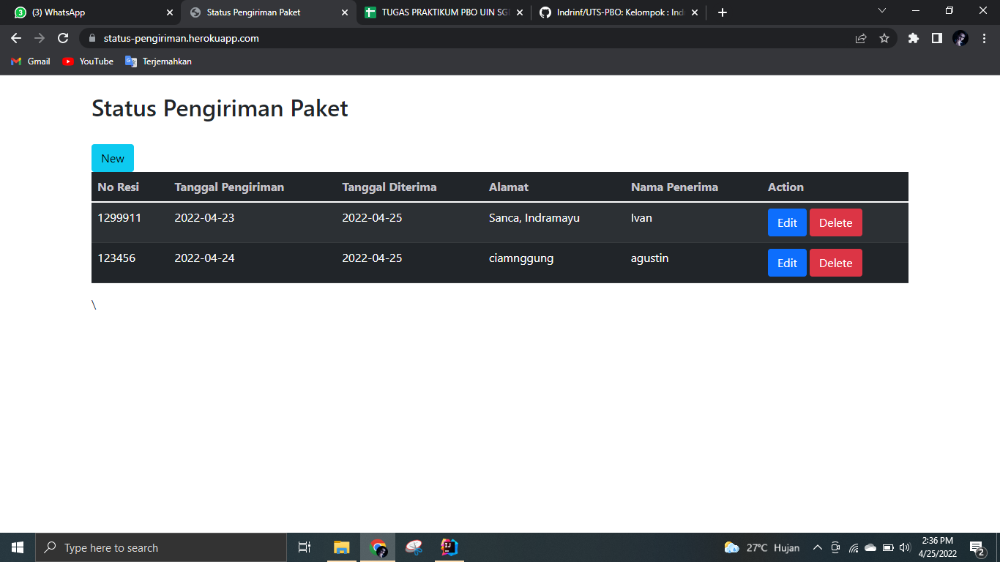

Forgot Password Page

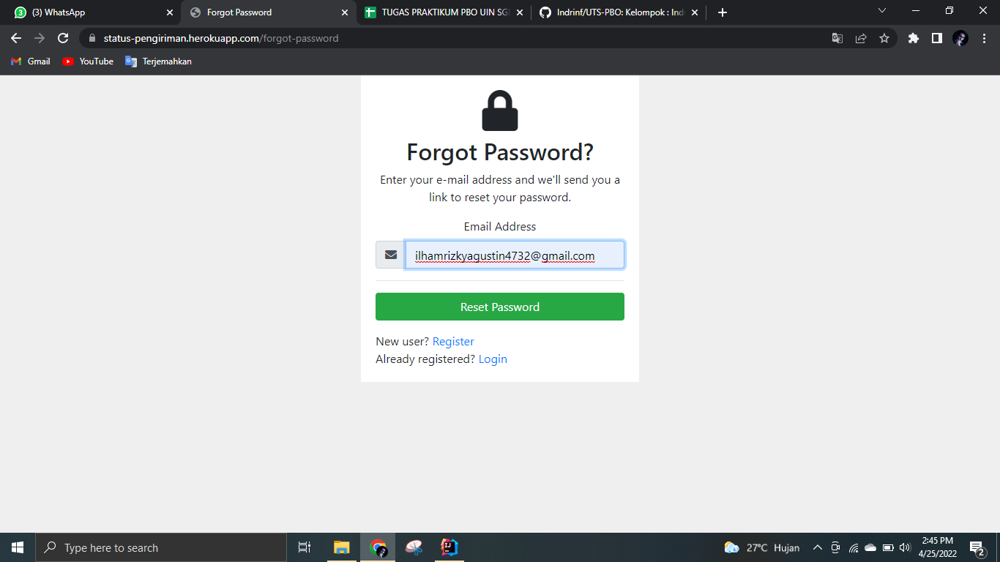

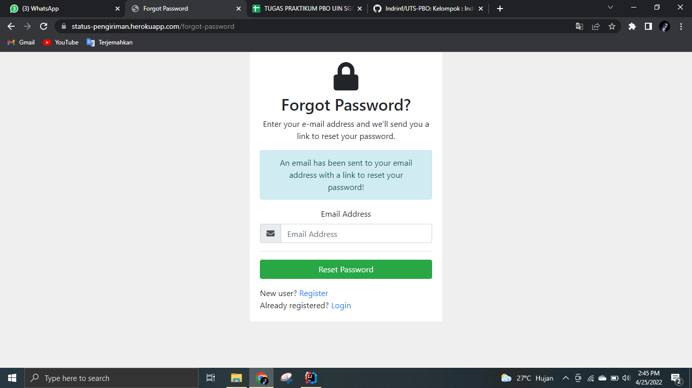
Email Inbox

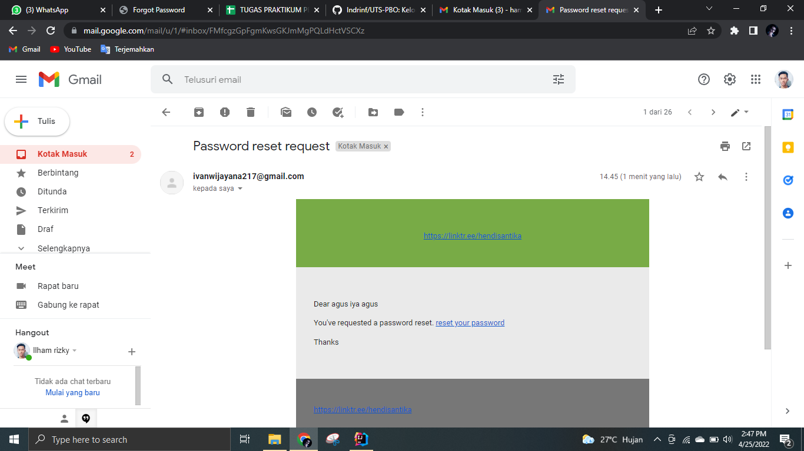

Reset Password Page

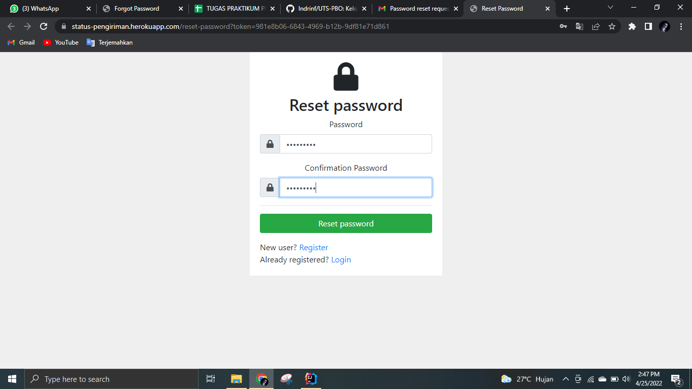
